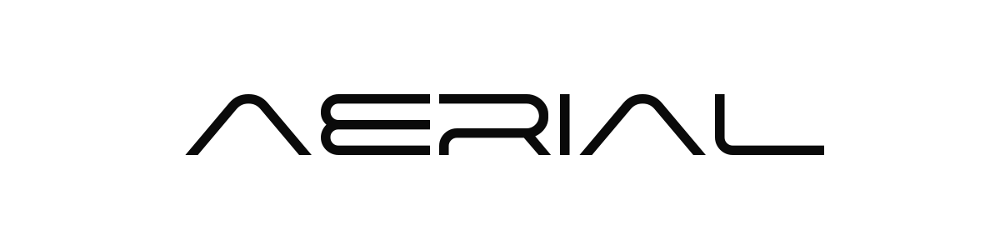

<div align="center">
  
  <br/><br/>
  <p><strong>A bare-metal, zero-copy CRDT canvas engine built in pure Rust.</strong></p>
  <p>120 FPS • Local-First • Offline Capable • Built for Scale</p>
</div>

---

## ⚡ Why Aerial Engine?

Most web-based whiteboard and canvas applications hit a hard memory and garbage collection ceiling after a few thousand strokes. To scale beyond that, you can't just write faster JavaScript. You need a different architecture.

**Aerial Engine** is the open-source (AGPL-3.0) core of the Aerial desktop app. It completely bypasses V8 garbage collection by managing all layout, strokes, and scene structures in a pure Rust WebAssembly (`wasm32-unknown-unknown`) environment.

### 🏗️ Architecture

- **Zero-Copy CRDTs**: Powered by `yrs` (Yjs Rust port). The entire canvas state is a reactive CRDT. There is no "syncing" step—drawing on the board intrinsically modifies the binary state vector, which can instantly compute missing deltas to beam over the wire.
- **Bare-Metal Storage**: Instead of IndexedDB wrapping JSON, we persist the canvas straight to disk using `redb`. High-throughput, local NVMe storage speeds with zero serialization lag.
- **Tauri Integration**: Built seamlessly for Tauri. Binary vectors are sent straight over the IPC bridge as raw `Uint8Array`s without expensive base64 JSON stringification.

## 📦 What's Included (The `aerial-core` workspace)

- **`aerial-engine`**: The Rust-compiled WASM module. Exposes our strict graphics bindings (`export_delta_update`, `apply_remote_delta`, `get_local_state_vector`) that can be embedded into any TypeScript frontend.
- **`src-tauri`**: The desktop bridge that wires the engine directly to the native OS file system.

*Note: The proprietary multi-room WebSocket relay and Local AI runtime (`rustama-engine`) are not included in this open-source release.*

## 🚀 Getting Started

### Prerequisites
- Node.js & npm
- Rust (`rustup default stable`)
- `wasm-pack`

### Build the Engine
Compile the WASM core for the web target:
```bash
cd aerial-core/aerial-engine
wasm-pack build --target web
```

Copy the output `pkg` folder to your public frontend directory (e.g., `public/aerial-engine`).

### Run the App
```bash
npm install
npm run tauri dev
```

## 📜 License

This core engine is licensed under the **AGPL-3.0 License**.

We believe in open-source infrastructure. If you're building an EdTech tool, a Notion clone, or a new productivity app, you can embed `aerial-engine` as your high-performance canvas layer, provided you open-source your modifications to the engine under the same terms.

---
*Built by Araskova Labs.*
